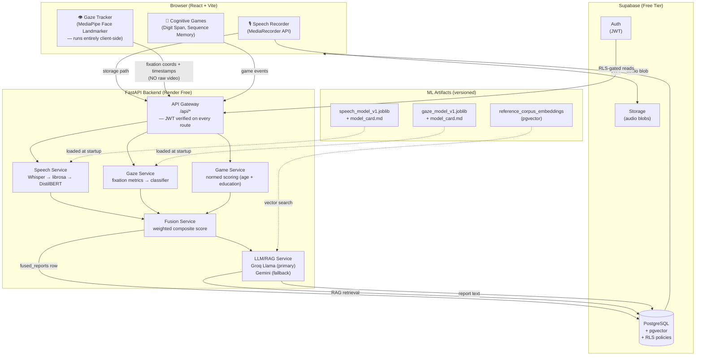

# CogniDetect — Architecture

## System Overview

CogniDetect is a multimodal cognitive-decline screening web app. Three capture
modalities (speech, gaze, cognitive games) run in the browser, their features
are processed by a FastAPI backend, fused into a composite risk indicator, and
explained via an LLM-powered report grounded in a fixed reference corpus.

---

## Architecture Diagram

---

## Layer Descriptions

### Browser
- All capture happens in the browser — the server never touches a camera or opens a window.
- MediaPipe Face Landmarker runs as a WASM module — only extracted iris coordinates are sent to the backend, never raw video frames.
- Auth state is managed by Supabase JS client; the JWT is attached to every API call.

### FastAPI Backend (Render free web service)
- Every route (`/api/*` except `/api/health`) requires a valid Supabase JWT.
- Role claims (`patient` / `doctor` / `admin`) are checked server-side from the JWT, never from a URL parameter or request body field.
- Services are stateless — they load model artifacts at startup and process requests. No local disk writes.

### Supabase
- Single source of truth for identity, relational data, file storage, and vector embeddings.
- Row Level Security enforced at the database level — patients can only read their own rows; doctors can only read rows for approved-linked patients.
- Audio blobs go to Supabase Storage (object store), never to the Render server's ephemeral filesystem.

### ML / RAG
- Model artifacts are trained offline (Colab/Kaggle) and versioned. They are loaded by the backend at startup.
- The LLM is used **only** to explain scores that already exist — it is never the scorer.
- RAG context = patient's own stored data + a fixed reference corpus (committed to `/docs/reference-corpus/`). The LLM cannot access the open web.

---

## Environment Variables

See `.env.example` at repo root for the full list with descriptions.

| Variable | Used by |
|---|---|
| `SUPABASE_URL` | Backend + Frontend |
| `SUPABASE_ANON_KEY` | Frontend (public) |
| `SUPABASE_SERVICE_ROLE_KEY` | Backend only — bypasses RLS, never expose to browser |
| `GROQ_API_KEY` | Backend |
| `GEMINI_API_KEY` | Backend (fallback) |
| `LLM_PROVIDER` | Backend (groq \| gemini) |
| `VITE_API_URL` | Frontend build — must point to deployed Render URL in prod |
| `ENVIRONMENT` | Backend (dev \| staging \| prod) |
